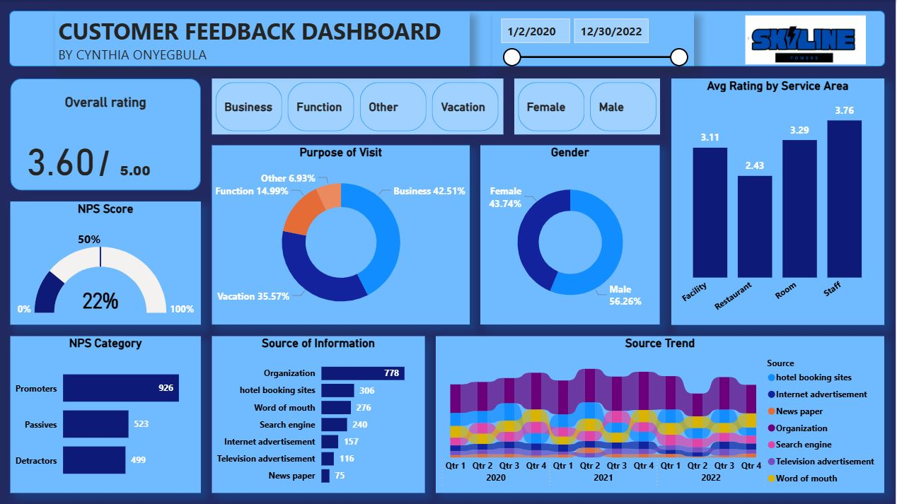

# Hotel-Customer-Feedback-Dashboard-Power-BI
A data storytelling project showing insights from hotel customer feedback data.

## Project Overview
This project is a fully interactive Customer Feedback Analytics Dashboard built in Power BI. It showcases how customer experience (CX), business insights, and data storytelling come together to support decision-making in the hospitality industry.
The dashboard analyzes 2+ years of customer feedback data from Skyline Towers, focusing on satisfaction scores, NPS performance, visitor demographics, and marketing effectiveness.
It is designed to help leadership identify customer pain points, understand guest behavior, and optimize areas that directly impact revenue and service delivery.

This project reflects my ability to:
- Clean and model data  
- Build intuitive, executive-ready dashboards  
- Translate complex data into actionable insights  
- Apply customer experience (CX) concepts in analytics  
- Present insights in a structured, business-focused way  

## Objectives of the Dashboard

The dashboard answers key business questions such as:
- What is our overall customer satisfaction rating?  
- How are customers scoring different service areas (staff, restaurant, rooms, facility)?  
- What is our Net Promoter Score (NPS) and how are promoters, passives, and detractors distributed?  
- What brings visitors to the hotel: business, vacation, events?  
- What are the most effective sources of customer acquisition?  
- How do these metrics trend across time (2020–2022)?

## Dashboard Overview

## Key Features

### Overall Rating
Shows average customer satisfaction on a 5-point scale.

### NPS Score & Category
- Dynamic calculation of Promoters, Passives, and Detractors  
- NPS % and distribution visualized clearly  
- Built with DAX measures for accuracy and scalability  

### Visitor Purpose & Gender Breakdown
Interactive visuals showing:
- Why customers visit  
- Gender distribution  

### Feedback by Service Area
Compares ratings across:
- Facilities  
- Restaurant  
- Rooms  
- Staff  

Helps identify which teams drive satisfaction or complaints.

### Source of Information
Ranks the most effective marketing channels:
- Organization partnerships  
- Booking sites  
- Word of mouth  
- Social/Internet ads  
- Newspapers & TV  

### Source Trend (2020–2022)
A multi-year area chart showing how each acquisition channel performed over time.

### Dynamic Slicers
Users can filter by:
- Purpose of visit  
- Gender  
- Date range  
All visuals update instantly for deeper exploration.

## Tools & Skills Used
### Power BI
- Data modeling  
- DAX measures  
- Dashboard development  
- Trend analysis  

### Analytics Skills
- Customer Experience (CX) analysis  
- Insight communication  
- Pattern recognition  
- Business decision support

## Insights Summary

A few insights uncovered in the dashboard:
- Business visitors make up the largest segment (42%).  
- Staff performance has the highest rating, while the restaurant scored the lowest.  
- Organizational partnerships drive the highest number of visitors overall, but drop when filtered by intent, revealing varying channel effectiveness.  
- Vacationers consistently rate services higher than business visitors.  
- NPS is 22%, indicating room for improvement in customer advocacy.

## Recommendations (Business & CX Focused)
### 1. Improve Restaurant Experience (Lowest Rated – 2.43/5)
The restaurant consistently underperforms across visitor types.
**Recommended actions:**
- Conduct short exit surveys to identify pain points (speed, taste, pricing, service).  
- Introduce a quality monitoring system (tasting sessions, menu refresh, internal/external reviews).  
- Offer meal bundles or loyalty discounts to improve perceived value.
**Impact:** Higher satisfaction → better NPS → increased repeat visits & referrals.

### 2. Strengthen Partnership Marketing (Top Source but Not Universal)
Organization partnerships generate the most visitors but are less effective for some segments (e.g., vacationers).
**Recommended actions:**
- Segment partnerships: business-focused vs. leisure/lifestyle.  
- Collaborate with travel agencies, tourism boards, and lifestyle brands.  
- Enhance referral programs and encourage guest-generated content.
**Impact:** More balanced acquisition channels and reduced dependency on one stream.

### 3. Protect and Leverage Staff as a Brand Asset (Highest Rated – 3.76/5)

Staff performance is the strongest part of the business.
Recommended actions:
- Highlight staff friendliness in marketing content.  
- Reward staff based on customer feedback.  
- Use training content to build brand trust.
**Impact:** Stronger customer connection, loyalty, and referrals.

### **4. Enhance Online Visibility on Search & Booking Sites**

Search engines and booking platforms are top acquisition channels but can be improved.
**Recommended actions:**
- Optimize SEO using relevant keywords.  
- Ensure consistent branding across booking platforms.  
- Improve website and social content; encourage Google reviews.
**Impact:** Increased organic traffic and reduced marketing spend.

### 5. Monitor Seasonal Trends for Better Resource Allocation
Channel performance fluctuates across quarters.
**Recommended actions:**
- Use quarterly trends to plan staffing, supplies, and promotions.  
- Increase digital ads during low-traffic periods.  
- Offer seasonal discounts based on visitor intent.
**Impact:** Cost savings and operational efficiency.

### 6. Create an Intent-Based Customer Experience Strategy
Vacationers and business visitors have different priorities.
**Recommended actions:**
- Vacationers: promote relaxation, spa, rooms, recreation.  
- Business visitors: emphasize reliability, WiFi, quiet zones, service speed.
**Impact:** Personalized experiences → better conversion & retention.

### 7. Improve Room Experience
Room quality is a core element of the hotel experience and directly affects satisfaction.
**Recommended actions:**
- Conduct a targeted review of feedback on room quality, cleanliness, amenities, and maintenance. Address recurring issues immediately.  
- Leverage top-performing staff to elevate the in-room experience through better room service, fast response times, and proactive housekeeping.
**Impact:** Higher satisfaction, better reviews, and stronger overall ratings.

## Why This Project Matters
This dashboard demonstrates how analytics supports:
- Customer experience improvement  
- Marketing strategy optimization  
- Operational decision-making  
- Performance tracking  
It also shows my ability to deliver end-to-end analytics solutions — from data cleaning and modeling to insights communication.

## About Me

I’m a Customer Experience and Data Analyst focused on using data to drive measurable improvements in customer satisfaction, operational efficiency, and business performance. I specialize in turning raw information into clear insights that help teams take action, solve problems, and deliver better results.
